# Explore Application Modernization Accelerator to modernize WebSphere applications

THIS LAB IS CURRENTLY UNDER DEVELOPMENT

<kbd>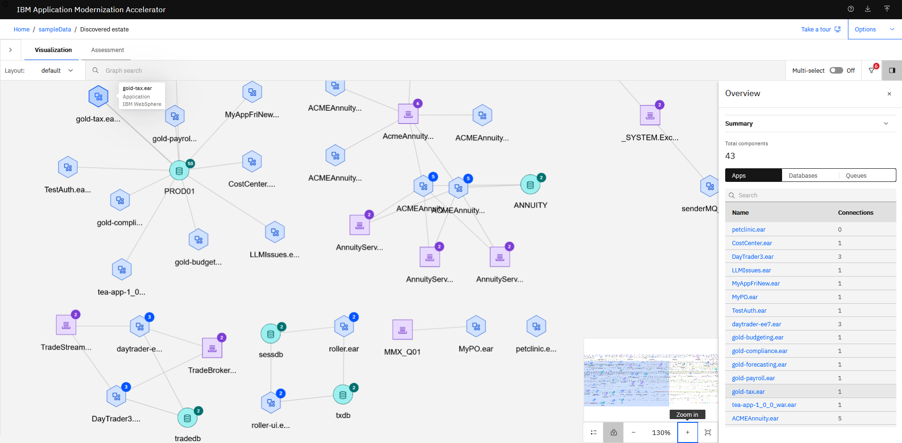</kbd>

**Last updated:** June 2026

**Duration:** 90 minutes

Need support? Contact **Lars Besselmann, Lars.Besselmann@de.ibm.com**

## Explore Application Modernization Accelerator

This lab provides fundamental hands-on experience of the evaluation process of WebSphere application for their modernization journey to Liberty. It shows the value of using Application Modernization Accelerator (AMA) to evaluate on-premises Java applications..

You will also learn how to use the deployment accelerators that AMA generates to help deploy and run Java applications on Liberty and in containers.

Upon completion of this lab, you will have gained experience using TA to quickly analyze on-premises Java applications without accessing their source code, estimate the effort in moving to container-based clouds, and using TA’s deployment accelerators to accelerate your application modernization journey to Liberty and containers.

The Application Modernization Accelerator provides the following value:

- identify the Java EE programming models in the app.

- determine the complexity of apps by listing a high-level inventory of the content and structure of each app.

- highlight Java EE programming model and WebSphere API differences between the WebSphere profile types

- identify Java EE specification implementation differences that might affect the app

- generate accelerators for deploying the application to Liberty and containers in a target environment.

Additionally, the tool provides a recommendation for the right-fit IBM WebSphere Application Server edition and offers advice, best practices, and potential solutions to assess the ease of moving apps to Liberty or newer versions of WebSphere traditional. It accelerates application migrating to cloud process, minimize errors and risks and reduce time to market.

## 1. Introduction

As shown in the image below, your company has several web applications deployed to WebSphere Application Server (WAS) environment.

<kbd></kbd>

Your company wants to move these applications to the modern WebSphere Liberty server on a container-based cloud. However, you are not sure how much effort the migration process might take.

You decide to use the IBM Application Modernization Accelerator to do a quick evaluation of these applications without their source code to identify a good candidate application to move to Liberty and container-based cloud.

After determining a candidate application for modernization to WebSphere Liberty, you use the accelerators generated by TA to deploy and run the application to WebSphere Liberty on your local developer machine and in containers to validate the solution.

## 2. Objective

The objectives of this lab are to:

- Learn how to collect Java application and configuration data using the Transformation Advisor Data Collector tool.

- Learn how to use the Application Modernization Accelerator to evaluate the effort involved to modernize to Liberty and container-based clouds and identify good application candidates for modernization.

- Learn how to use the accelerators generated by Application Modernization Accelerator to deploy a candidate application to WebSphere Liberty and containers.

## 3. Prerequisites

The following prerequisites must be completed prior to beginning this lab:

- Familiarity with basic Linux commands

- Have internet access

- Have a lab environment ready

## 4. About the lab environment

The lab is written for a lab environment hosted by IBM and the software is already installed.

The following software hsa been installed:
- Java 17 or beyond 
- Maven
- Git
- WebSphere Application Server Network Deployment
- The Applicatin Modernization Accelerator
- Visual Studio Code with the following extensions:
    - The Liberty Tools
    - The Applicatin Modernization Accelerator Development Tools (AMA Dev Tools)

## 5. Explore Application Modernization Accelerator
In this section, you will explore the main capabilities of Application Modernization Accelerator. You will use the sample data that is shipped with the product. 

### 5.1 Start AMA

Application Modernization Accelerator(AMA) is already installed nd typically running. 

Let's check if AMA is already started. This can be validated by reviewing if the related podman containers are started. 

1. Open a terminal by clicking on Activities and selecting terminal.

    <kbd>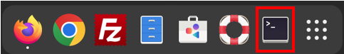</kbd>

    The terminal window opens.  

    <kbd>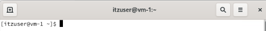</kbd>

    HINT: By detfault, the terminal window has a dark background.

2. Access the AMA launch script to verify if AMA is started or not

        cd ~/usr/IBM/application-modernization-accelerator-local-*
        ./launch.sh

        
    Check the status if AMA is started. 
    If AMA **is available** (see screenshot below), enter **q** to quit the menu and keep AMA running. 

    <kbd>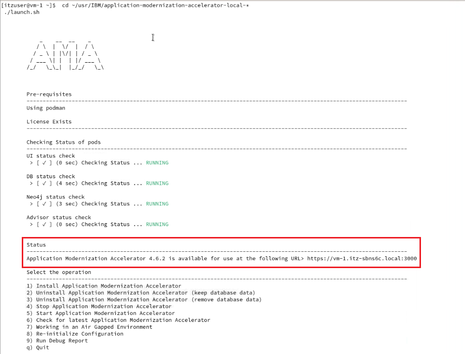</kbd>
        
    If AMA is **not running** (see screenshot below), enter **5** to start AMA. 
    <kbd>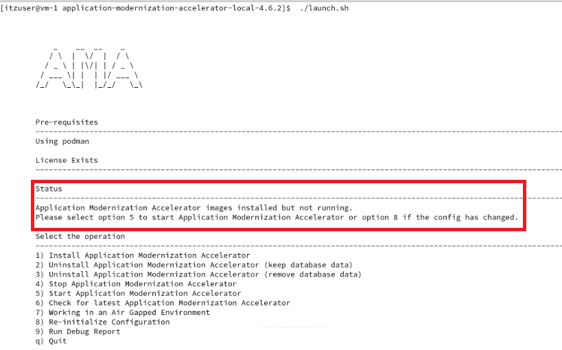</kbd>
        
    Wait until AMA has started and the URL is displayed
    <kbd>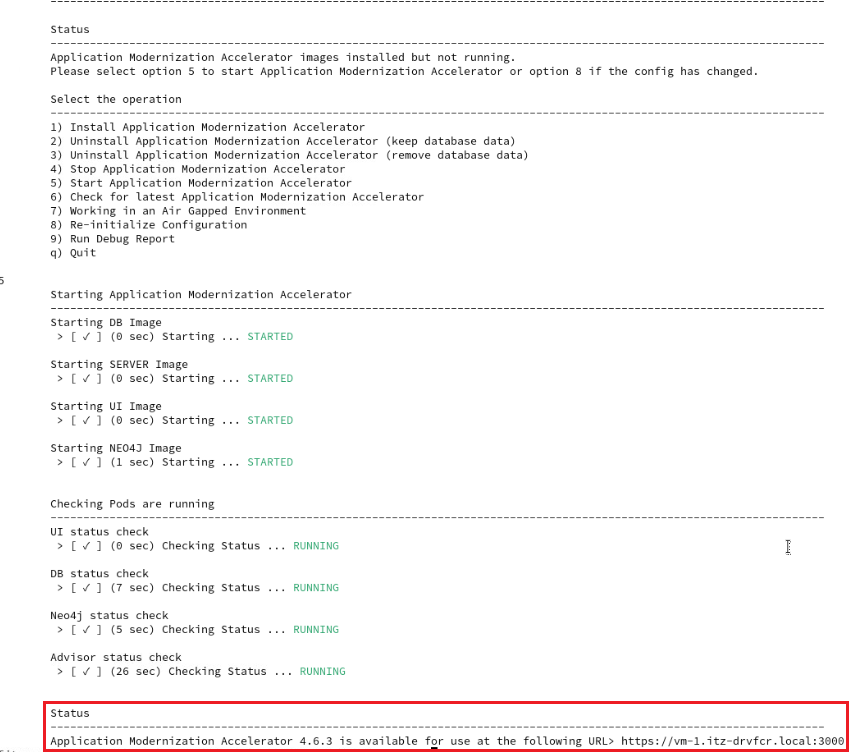</kbd>

### 5.2 Explore the AMA User Interface
1. Access the AMA UI and create a workspace with sample applications
    1. Open a browser window by clicking on **Activities** and then select the **Firefox** browser icon.

        <kbd>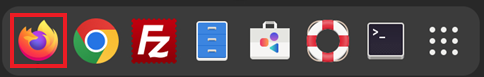</kbd>

    2. Access the AMA User Interface via the URL http://localhost:30000

        <kbd>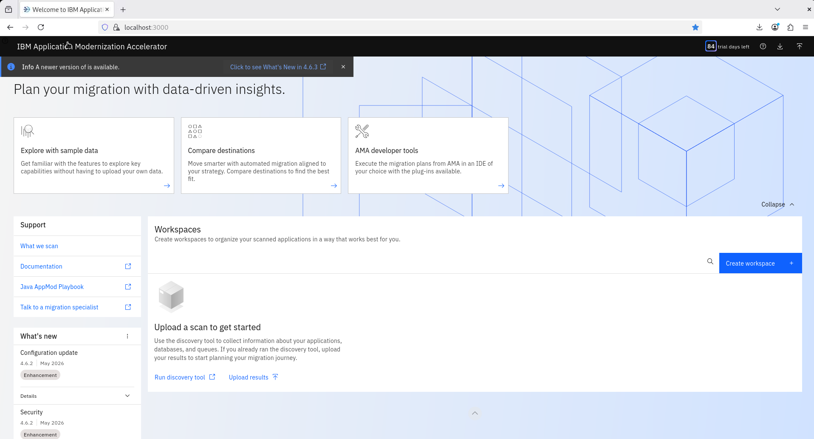</kbd>
    

    3. Click on the button **Create workspace** and enter **tWAS**, select **incluide sample data**, then click on **Create**.

        <kbd>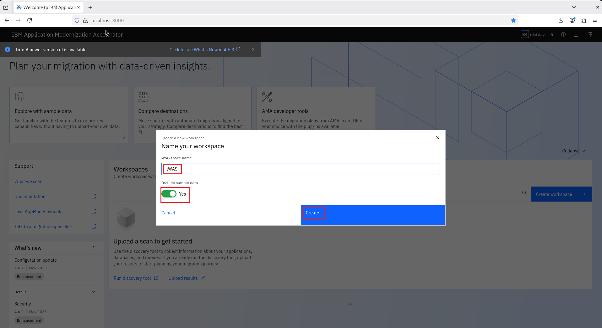</kbd>
    
    4. The workspace will be created.
        <kbd>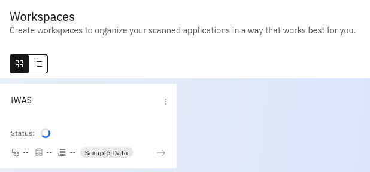</kbd>
    
    5. Wait until the workspace has been created which can take a minute or so. Finally you will see that the workspace has been created and contains 29 sample applications, 7 databases and 9 queues.
        <kbd>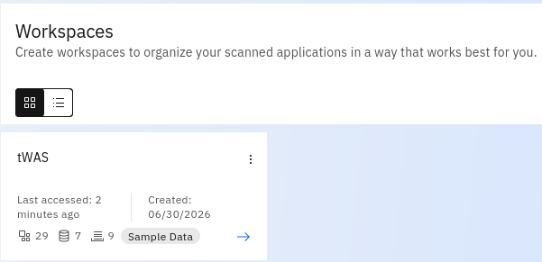</kbd>
    
2. Explore the workspace with the sample applications

    1. CLick on the workspace to open it.

    2. AMA supports three destinations, **Liberty**, **MoRE** and **WebSphere Application Server** (Traditional)
    
        <kbd>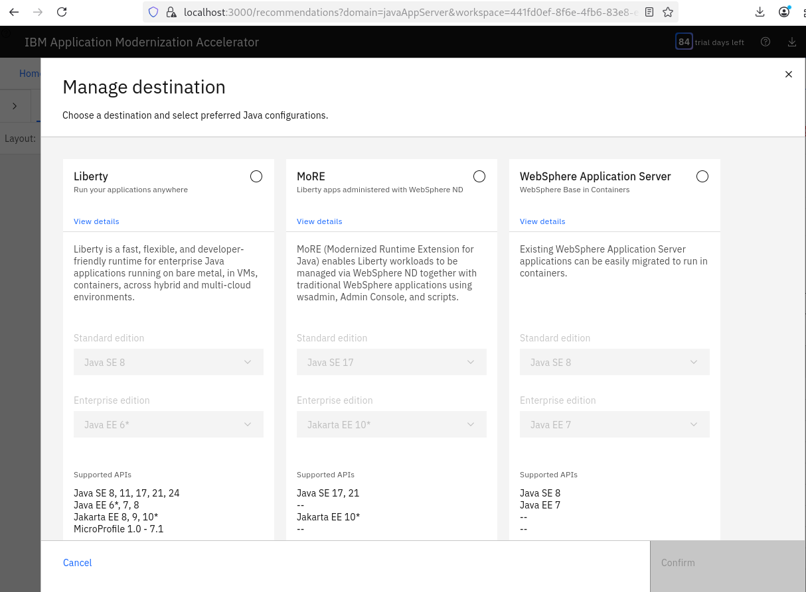</kbd>
    
    3. Select **Liberty** as destination and click on **Confirm**.
    
        <kbd>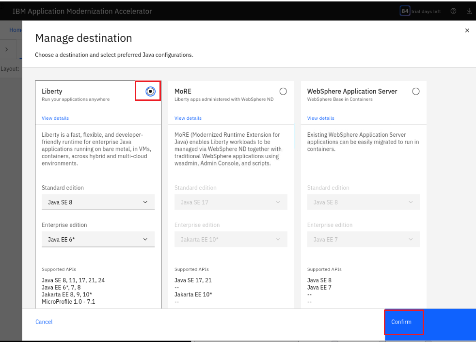</kbd>
    

    4. The **Visualization** panel shows all applications and how they relate to each other regarding common databases or queues.
    Zoom in to see the application names.

        <kbd>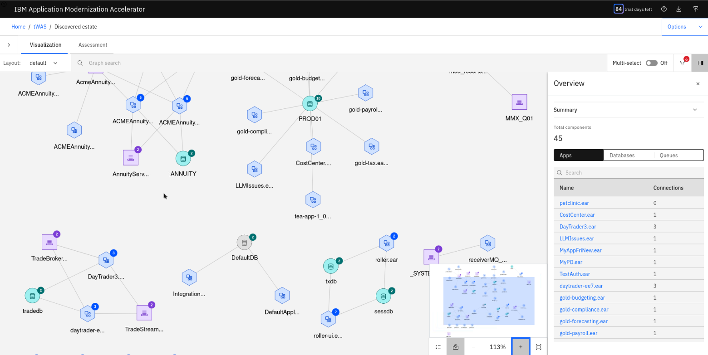</kbd>
    
        You can filter by name to see only specific applications and dependencies.

        <kbd>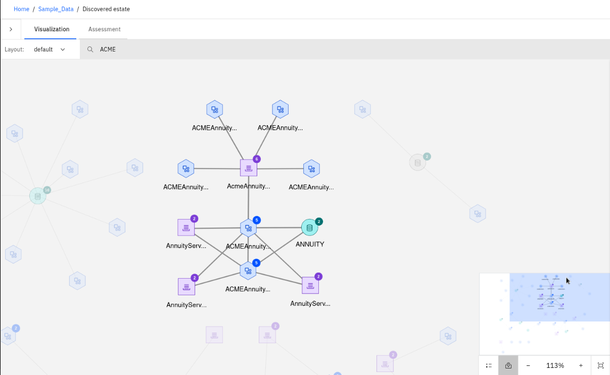</kbd>
    
        You can also filter by library to see only specific applications and dependencies.

        <kbd>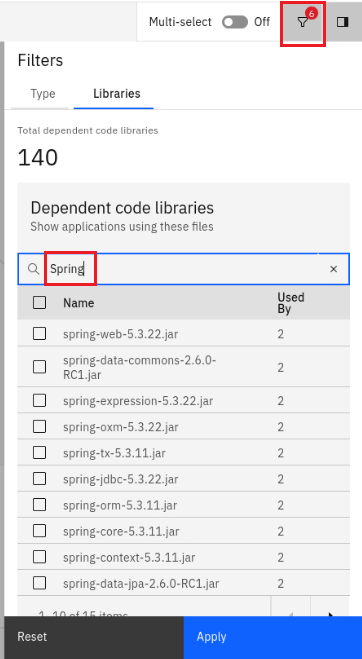</kbd>
    
    As you can see in the screenshot above, the visualization provides insight which applications share the same database or queue which helps to shape your migration strategy.

    5. Switch to the **Assessment** tab 

        <kbd>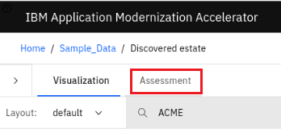</kbd>
    
        The assessment tab provides ingithh into the different applications.
        <kbd>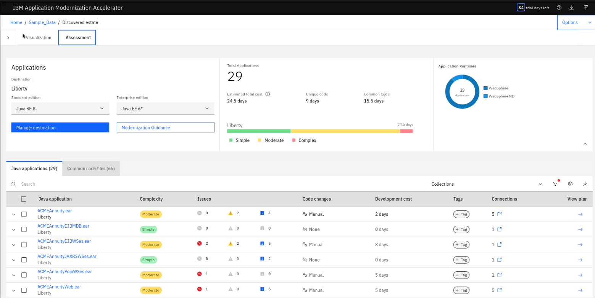</kbd>
    
    6. Under **Applications**, you can specify the target  Java SE and Java EE level.

        <kbd>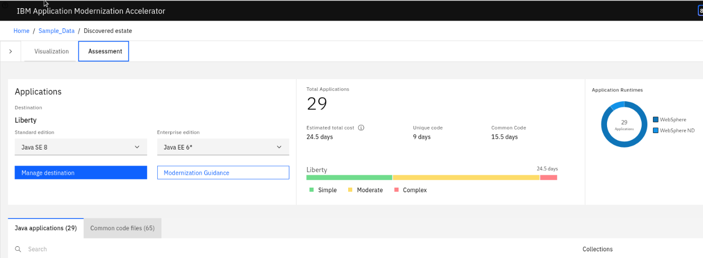</kbd>

        Under **Total Applications**, you can see the effort for the chosen target. AMA also analyzes all the application code and common code that is shared across applications and provides an estimated total cost for migrating the apps and common code in the workspace. 
        
        Total cost is the number of days of development cost to migrate that code to run on the selected migration target. In this example, WebSphere Liberty is the selected migration target.

    7. Change the Java SE Level and the Java EE level to find out how the overall effort changes.

        <kbd>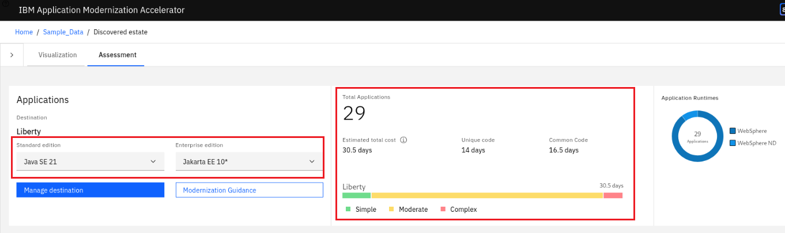</kbd>

        Finally change the Java SE and Java EE level back to the minimum to see the efforts for te quickest path of modernization.

    8. Take a look further down at the application list.

        <kbd>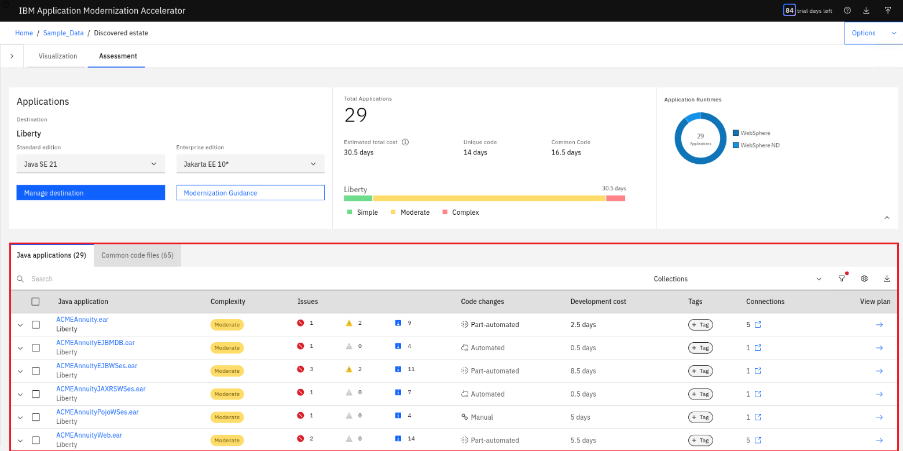</kbd>
    
        The “All Java applications” page also shows the application summary analysis results for all the apps from the AppSrv01 profile for each of the selected migration targets.

        For each app / migration target combination, you can see these results:

        - Java application
        - Collection / Profile name
        - Complexity
        - Issues
        - Required code changes
        - Application cost (in days)
        - Migration plan

        The following details are included in the summary table (this is the per-application view):

        - Application Name: The name of the EAR/WAR file found on the application server.

        - Collection/Profile: Collection represents the hostname of the machine where the application resides. The profile represents the profile name in the application server where the application is installed.

        - Complexity: Indicates how complex Transformation Advisor considers this application to be if you were to migrate it to the cloud.

        - Issues: The number and severity of potential issues with the migration of the application.

        - Required code changes: Indicates the type of code change needed.

        - Application cost in days: Provides an estimate in days for the development effort to perform the migration for just this application. Cost estimates calculated by Transformation Advisor are high-level estimates only and may vary widely based on skills and other factors not considered by the tool.

        - Migration plan: accelerator files generated by Transformation advisor to aide in building and deploying the selected application to the target runtime.

    9. Feel free to expand the one or other app to see more details about an application.
        <kbd>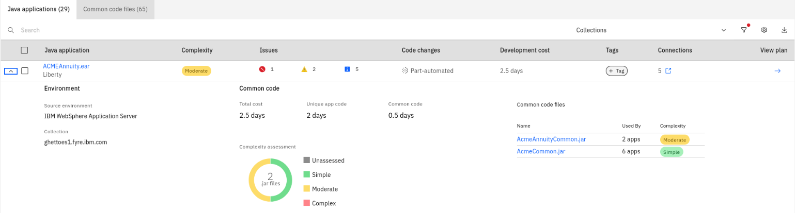</kbd>
    

### 5.3 Explore the AMA APIs
Application Modernization Accelerator (AMA) also provides Swagger interfaces to access some of the data via APIs.

1. Open a browser and enter the following URL:
    https://localhost:2220/openapi/ui/

    <kbd>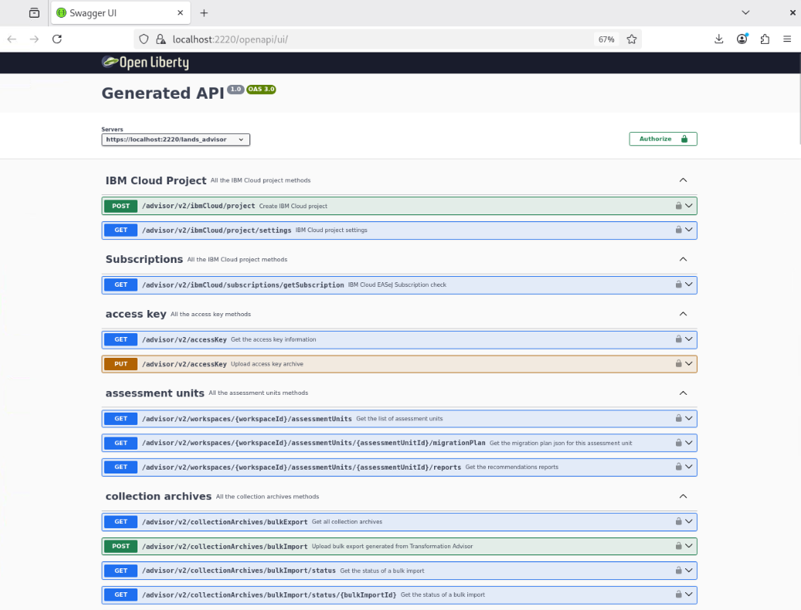</kbd>

2. Look at the different APIs which allow to create a new workspace, upload a data collection or bulk, upload the license key and much more.

The create for example the demo workspace which you just created manually, you could use the following command:

    curl -k -X 'POST' \
    'https://localhost:2220/lands_advisor/advisor/v2/collectionArchives/uploadSampleData' \
      -H 'accept: */*' \
      -H 'locale: en' \
      -H 'workspaceName: sampleData' \
      -d ''

Right now, you just explored the capabilities of AMA based on sample data. In the next section, you will analyze the modresorts application to identify the efforts to migrate it from traditional WAS to Liberty. You will use the AMA Discovery tool to gather the data collection from an existing WebSphere installation and perform some analysis.
Then you will use the AMA Dev Tools to make the required code changes.

## 6. Build and analyze the modesorts application.

### 6.1 Verify the installed software 

1. Open a terminal by clicking on Activities and selecting terminal.

    <kbd></kbd>

    The terminal window opens.

    <kbd></kbd>

2. Check the Maven version via the following command:

        mvn -version

    <kbd>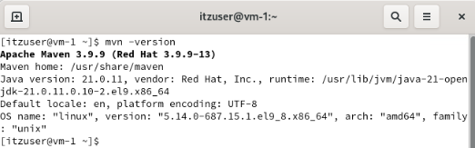</kbd>
    
    The version might be slightly different, but must be higher than 3.8.5

3. Check the Git version via the following command:

        git -v

    <kbd>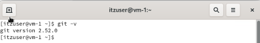</kbd>

    The version might be slightly different.

### 6.2 Create the required working directories

1. Create the Student directories and some sub-directories used in the lab with commands:

        mkdir ~/Student
        mkdir ~/Student/assets
        mkdir ~/Student/backup

### 6.3 Build and deploy the WebSphere applications

The objective of this section is to assess the simple-pharmacy application that has been deployed to a traditional WAS 9 instance.

### 6.3.1 Build the WAS appplication

1. Clone the repository to get access to the application binaries and more.

        git clone https://github.com/LarsBesselmann/sample-app-mod-ama ~/Student/modresorts-project

2. Install the required WAS library

        cd ~/Student/modresorts-project/

        mvn install:install-file -Dfile=/home/itzuser/usr/IBM/WebSphere/AppServer/dev/was_public.jar -DpomFile=/home/itzuser/usr/IBM/WebSphere/AppServer/dev/was_public-9.0.0.pom

      <kbd>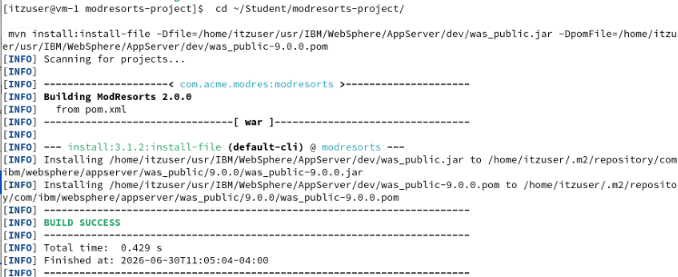</kbd>

3. Build the application
    
        mvn clean package

      <kbd>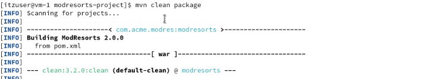</kbd>

    <kbd>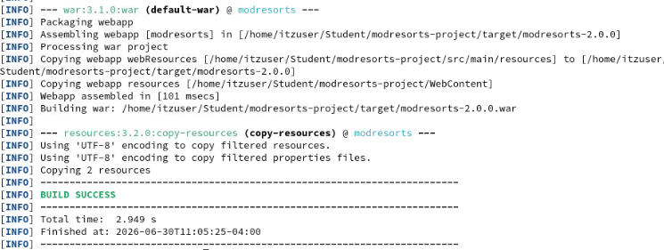</kbd>

### 6.3.2 Deploy the WebSphere application and test it

The application has not been installed to traditional WAS so far. You will first deploy the application to an eisting WAS ND instance. Then you will test if the application as is works fine or not.

1. Switch to the terminal window.

2. Enter the following command to start the Deployment Manager

        ~/usr/IBM/WebSphere/AppServer/profiles/Dmgr01/bin/startManager.sh

    Wait until the Deployment Manager has been started

    <kbd>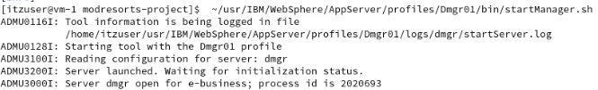</kbd>

3. Enter the following command to start the Note Agent

       ~/usr/IBM/WebSphere/AppServer/profiles/AppSrv01/bin/startNode.sh

    Wait until the Node agent has been started
    
    <kbd>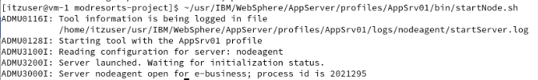</kbd>

4. Deploy the application using wsadmin by entering the following commands:

        cd ~/Student/modresorts-project/tWAS-Scripts

        ~/usr/IBM/WebSphere/AppServer/profiles/Dmgr01/bin/wsadmin.sh -f ./modresorts_install.py

        ~/usr/IBM/WebSphere/AppServer/profiles/Dmgr01/bin/wsadmin.sh -f ./setURLProvider.py

5. Enter the following command to start the WAS server server1

       ~/usr/IBM/WebSphere/AppServer/profiles/AppSrv01/bin/startServer.sh server1

    Wait until the server serer1 has been started
    
    <kbd></kbd>

6. Test the application

    1. Open a browser window by clicking on **Activities** and then select the **Firefox** browser icon.

        <kbd></kbd>

    2. Access the application on tWAS using the URL http://localhost:9080/resorts

    3. Click on the link for **Security** and check that there are no errors shown. Then scroll down and click on the kink to return to the main page.

    4. Click on the link for **logout** and check that there are no errors

7. Stop the WAS instances

        ~/usr/IBM/WebSphere/AppServer/profiles/AppSrv01/bin/stopServer.sh server1
        ~/usr/IBM/WebSphere/AppServer/profiles/AppSrv01/bin/stopNode.sh
        ~/usr/IBM/WebSphere/AppServer/profiles/Dmgr01/bin/stopManager.sh

### 6.3.3 Create a AMA data collection for the WAS applications

[itzuser@vm-1 work]$ cd ../usr/IBM/
[itzuser@vm-1 IBM]$ tar -zxf ~/Downloads/DiscoveryTool-Linux_localWAS.tgz
[itzuser@vm-1 IBM]$

### 6.3.2 Assess the applications using AMA

### 6.3.8 Recap

Congratulations, you have finished the application assessment part.

**Let’s recap what you did so far.** 

### 6.3.9 Troubleshooting

You will need the migratin plan in the next section. 

1. If not already done, create the required working directories

        mkdir ~/Student
        mkdir ~/Student/assets
        
2. Create a backup directory and clone the repository 
 
        mkdir ~/Student/backup
        git clone https://github.com/LarsBesselmann/LibertyGettingStarted-2026-Lab ~/home/itzuser/Student/backup

3. Copy the server package to the assets directory

        cp ~/Student/backup/assets/simpleweb-serverpackage.jar ~/Student/assets

 

### 6.4 Use the AMA Dev Tools

### 6.5 Recap

Let’s recap what you did in this part of the lab: 

### 7 Lab Cleanup

1. Once you are done, make sure that Liberty and Visual Studio Code is not running.

2. Delete the Student folder via command:

        rm -rf ~/Student

3. Close the browser and all terminal windows

## Summary

In this lab, you learned how to assess a WebSphere application using IBM Application Modernization Accelerator.

**Congratulations!**

**You have successfully completed the lab "Liberty Getting Started"**

# Troubleshooting

Details around troubleshooting

