# Explore Application Modernization Accelerator to modernize WebSphere applications

THIS LAB IS CURRENTLY UNDER DEVELOPMENT

<kbd></kbd>

**Last updated:** June 2026

**Duration:** 90 minutes

Need support? Contact **Lars Besselmann, Lars.Besselmann@de.ibm.com**

## Explore Application Modernization Accelerator

This lab provides fundamental hands-on experience of the evaluation process of WebSphere application for their modernization journey to Liberty. It shows the value of using Application Modernization Accelerator (AMA) to evaluate on-premises Java applications..

You will also learn how to use the deployment accelerators that AMA generates to help deploy and run Java applications on Liberty and in containers.

Upon completion of this lab, you will have gained experience using TA to quickly analyze on-premises Java applications without accessing their source code, estimate the effort in moving to container-based clouds, and using TA’s deployment accelerators to accelerate your application modernization journey to Liberty and containers.

The Application Modernization Accelerator provides the following value:

- identify the Java EE programming models in the app.

- determine the complexity of apps by listing a high-level inventory of the content and structure of each app.

- highlight Java EE programming model and WebSphere API differences between the WebSphere profile types

- identify Java EE specification implementation differences that might affect the app

- generate accelerators for deploying the application to Liberty and containers in a target environment.

Additionally, the tool provides a recommendation for the right-fit IBM WebSphere Application Server edition and offers advice, best practices, and potential solutions to assess the ease of moving apps to Liberty or newer versions of WebSphere traditional. It accelerates application migrating to cloud process, minimize errors and risks and reduce time to market.

## 1. Introduction

As shown in the image below, your company has several web applications deployed to WebSphere Application Server (WAS) environment.

<kbd></kbd>

Your company wants to move these applications to the modern WebSphere Liberty server on a container-based cloud. However, you are not sure how much effort the migration process might take.

You decide to use the IBM Application Modernization Accelerator to do a quick evaluation of these applications without their source code to identify a good candidate application to move to Liberty and container-based cloud.

After determining a candidate application for modernization to WebSphere Liberty, you use the accelerators generated by TA to deploy and run the application to WebSphere Liberty on your local developer machine and in containers to validate the solution.

## 2. Objective

The objectives of this lab are to:

- Learn how to collect Java application and configuration data using the Transformation Advisor Data Collector tool.

- Learn how to use the Application Modernization Accelerator to evaluate the effort involved to modernize to Liberty and container-based clouds and identify good application candidates for modernization.

- Learn how to use the accelerators generated by Application Modernization Accelerator to deploy a candidate application to WebSphere Liberty and containers.

## 3. Prerequisites

The following prerequisites must be completed prior to beginning this lab:

- Familiarity with basic Linux commands

- Have internet access

- Have a lab environment ready

## 4. About the lab environment

The lab is written for a lab environment hosted by IBM and the software is already installed.

The following software hsa been installed:
- Java 17 or beyond 
- Maven
- Git
- WebSphere Application Server Network Deployment
- The Applicatin Modernization Accelerator
- Visual Studio Code with the following extensions:
    - The Liberty Tools
    - The Applicatin Modernization Accelerator Development Tools (AMA Dev Tools)

## 5. Explore Application Modernization Accelerator
In this section, you will explore the main capabilities of Application Modernization Accelerator. You will use the sample data that is shipped with the product. 

### 5.1 Start AMA

Application Modernization Accelerator(AMA) is already installed nd typically running. 

Let's check if AMA is already started. This can be validated by reviewing if the related podman containers are started. 

1. Open a terminal by clicking on Activities and selecting terminal.

    <kbd></kbd>

    The terminal window opens.  

    <kbd></kbd>

    HINT: By detfault, the terminal window has a dark background.

2. Access the AMA launch script to verify if AMA is started or not

        cd ~/usr/IBM/application-modernization-accelerator-local-*
        ./launch.sh

        
    Check the status if AMA is started. 
    If AMA **is available** (see screenshot below), enter **q** to quit the menu and keep AMA running. 

    <kbd></kbd>
        
    If AMA is **not running** (see screenshot below), enter **5** to start AMA. 
    <kbd></kbd>
        
    Wait until AMA has started and the URL is displayed
    <kbd></kbd>

### 5.2 Explore the AMA User Interface
To explore the AMA User Interface, you will create a workspace with sample data. A workspace is a designated area that will house the migration recommendations provided by AMA for existing applications and/or environments. You can name and organize these however you want, whether it’s by business application, location, or teams.
Later on, you will create another workspace for the WebSphere landscape used in this lab environment.

1. Access the AMA UI and create a workspace with sample applications.
    1. Open a browser window by clicking on **Activities** and then select the **Firefox** browser icon.

        <kbd></kbd>

    2. Access the AMA User Interface via the URL https://localhost:3000

        If you get a warning, that there is a potential security risk, click on **Advanced** and then **Accept the Risk and Continue**. 

        <kbd>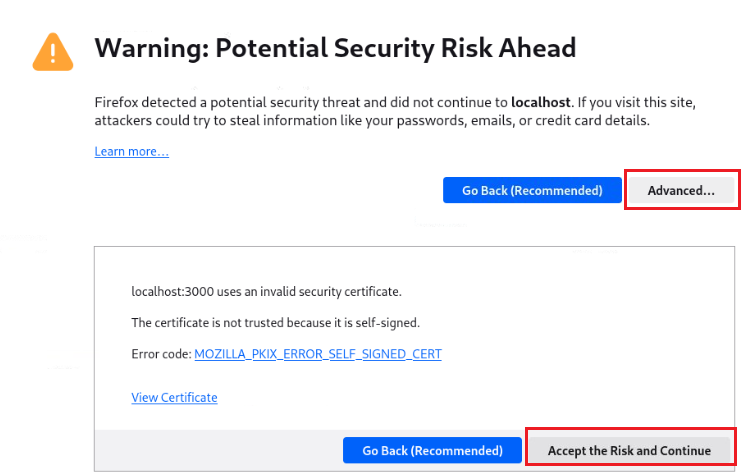</kbd>
    
        Finally you should see the Application Modernization Overview Screen.

        <kbd>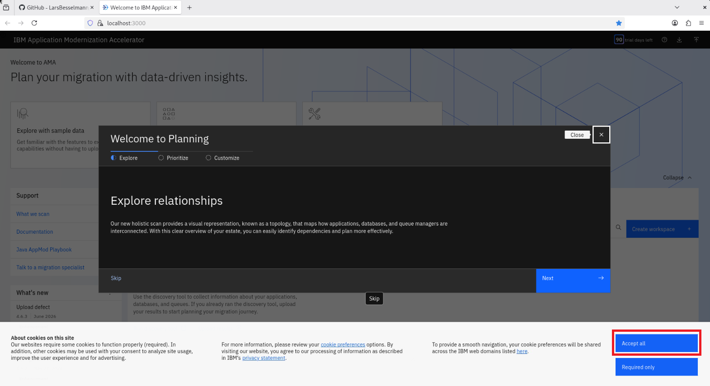</kbd>
    
        Click the button to **Accept all** to accept all cookies.
        An introduction wizard is displayed.

        <kbd>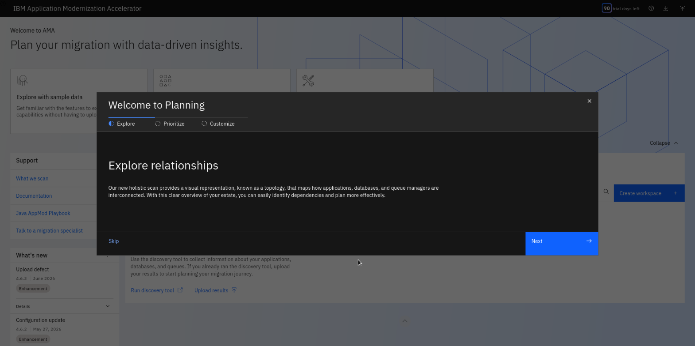</kbd>
    
        Click through the wizard and finally close it.
        Your screen should now look like this:

        <kbd></kbd>
    

    3. Click on the button **Create workspace** and enter **Sample_Data**, select **include sample data**, then click on **Create**.

        <kbd>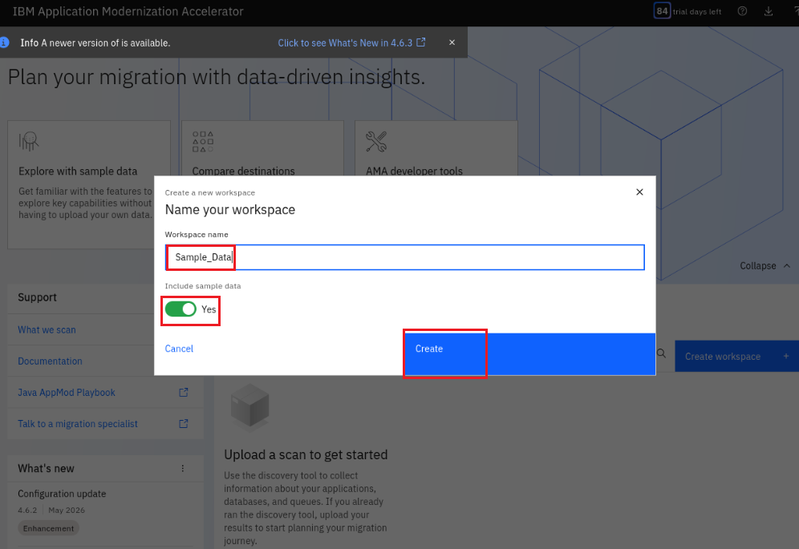</kbd>
    
    4. The workspace will be created.
        <kbd>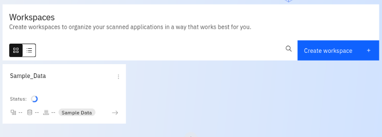</kbd>
    
    5. Wait until the workspace has been created which can take a minute or so. Finally you will see that the workspace has been created and contains 29 sample applications, 7 databases and 9 queues.
        <kbd>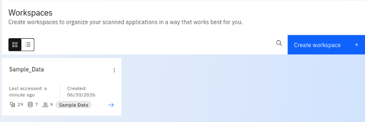</kbd>
    
2. Explore the workspace with the sample applications

    1. CLick on the workspace to open it.

    2. AMA supports three destinations, **Liberty**, **MoRE** and **WebSphere Application Server** (Traditional)
    
        <kbd></kbd>
    
    3. Select **Liberty** as destination and click on **Confirm**.
    
        <kbd></kbd>
    

    4. The **Visualization** panel shows all applications and how they relate to each other regarding common databases or queues.
    Zoom in to see the application names.

        <kbd></kbd>
    
        You can filter by name to see only specific applications and dependencies.

        <kbd></kbd>
    
        You can also filter by library to see only specific applications and dependencies.

        <kbd></kbd>
    
    As you can see in the screenshot above, the visualization provides insight which applications share the same database or queue which helps to shape your migration strategy.

    5. Switch to the **Assessment** tab 

        <kbd></kbd>
    
        The assessment tab provides insight into the different applications.
        <kbd></kbd>
    
    6. Under **Applications**, you can specify the target Java SE and Java EE level.

        <kbd></kbd>

        Under **Total Applications**, you can see the effort for the chosen target. AMA also analyzes all the application code and common code that is shared across applications and provides an estimated total cost for migrating the apps and common code in the workspace. 
        
        Total cost is the number of days of development cost to migrate that code to run on the selected migration target. In this example, WebSphere Liberty is the selected migration target.

    7. Change the Java SE Level and the Java EE level to find out how the overall effort changes.

        <kbd></kbd>

        Finally change the Java SE and Java EE level back to the minimum to see the efforts for te quickest path of modernization.

    8. Take a look further down at the application list.

        <kbd></kbd>
    
        The “All Java applications” page also shows the application summary analysis results for all the apps from the AppSrv01 profile for each of the selected migration targets.

        For each app / migration target combination, you can see these results:

        - Java application
        - Collection / Profile name
        - Complexity
        - Issues
        - Required code changes
        - Application cost (in days)
        - Migration plan

        The following details are included in the summary table (this is the per-application view):

        - Application Name: The name of the EAR/WAR file found on the application server.

        - Collection/Profile: Collection represents the hostname of the machine where the application resides. The profile represents the profile name in the application server where the application is installed.

        - Complexity: Indicates how complex Transformation Advisor considers this application to be if you were to migrate it to the cloud.

        - Issues: The number and severity of potential issues with the migration of the application.

        - Required code changes: Indicates the type of code change needed.

        - Application cost in days: Provides an estimate in days for the development effort to perform the migration for just this application. Cost estimates calculated by Transformation Advisor are high-level estimates only and may vary widely based on skills and other factors not considered by the tool.

        - Migration plan: accelerator files generated by Transformation advisor to aide in building and deploying the selected application to the target runtime.

    9. Feel free to expand the one or other app to see more details about an application.
        <kbd></kbd>
    

### 5.3 Explore the AMA APIs
Application Modernization Accelerator (AMA) also provides Swagger interfaces to access some of the data via APIs.

1. Open a browser and enter the following URL:
    https://localhost:2220/openapi/ui/

    <kbd></kbd>

2. Look at the different APIs which allow to create a new workspace, upload a data collection or bulk, upload the license key and much more.

The create for example the demo workspace which you just created manually, you could use the following command:

    curl -k -X 'POST' \
    'https://localhost:2220/lands_advisor/advisor/v2/collectionArchives/uploadSampleData' \
      -H 'accept: */*' \
      -H 'locale: en' \
      -H 'workspaceName: Sample_Data' \
      -d ''

Right now, you just explored the capabilities of AMA based on sample data. In the next section, you will analyze the modresorts application to identify the efforts to migrate it from traditional WAS to Liberty. You will use the AMA Discovery tool to gather the data collection from an existing WebSphere installation and perform some analysis.
Then you will use the AMA Dev Tools to make the required code changes.

## 6. Build and analyze the modesorts application.

### 6.1 Verify the installed software 

1. Open a terminal by clicking on Activities and selecting terminal.

    <kbd></kbd>

    The terminal window opens.

    <kbd></kbd>

2. Check the Maven version via the following command:

        mvn -version

    <kbd></kbd>
    
    The version might be slightly different, but must be higher than 3.8.5

3. Check the Git version via the following command:

        git -v

    <kbd></kbd>

    The version might be slightly different.

### 6.2 Create the required working directories

1. Create the Student directories and some sub-directories used in the lab with commands:

        mkdir ~/Student
        mkdir ~/Student/assets
        mkdir ~/Student/backup

### 6.3 Build and deploy the WebSphere applications

The objective of this section is to assess the simple-pharmacy application that has been deployed to a traditional WAS 9 instance.

### 6.3.1 Build the WAS application

1. Clone the repository to get access to the application binaries and more.

        rm -rf ~/Student/temprepo/
        git clone https://github.com/LarsBesselmann/LibertyGettingStarted-2026-AMA-Lab ~/Student/temprepo
        mv ~/Student/temprepo/modresorts-project ~/Student
        rm -rf ~/Student/temprepo/

2. Install the required WAS library

        cd ~/Student/modresorts-project/

        mvn install:install-file -Dfile=/home/itzuser/usr/IBM/WebSphere/AppServer/dev/was_public.jar -DpomFile=/home/itzuser/usr/IBM/WebSphere/AppServer/dev/was_public-9.0.0.pom

    <kbd></kbd>

3. Build the application
    
        mvn clean package

    <kbd></kbd>

    <kbd></kbd>

4. Copy the generated war file into the assets directory
    
        cp ~/Student/modresorts-project/target/modresorts-2.0.0.war ~/Student/assets/

### 6.3.2 Deploy the WebSphere application and test it

The application has not been installed to traditional WAS so far. You will first deploy the application to an eisting WAS ND instance. Then you will test if the application as is works fine or not.

1. Switch to the terminal window.

2. Enter the following command to start the Deployment Manager

        ~/usr/IBM/WebSphere/AppServer/profiles/Dmgr01/bin/startManager.sh

    Wait until the Deployment Manager has been started

    <kbd></kbd>

3. Enter the following command to start the Note Agent

       ~/usr/IBM/WebSphere/AppServer/profiles/AppSrv01/bin/startNode.sh

    Wait until the Node agent has been started
    
    <kbd></kbd>

4. Deploy the application using wsadmin by entering the following commands:

        cd ~/Student/modresorts-project/tWAS-Scripts

        ~/usr/IBM/WebSphere/AppServer/profiles/Dmgr01/bin/wsadmin.sh -f ./modresorts_install.py

    <kbd>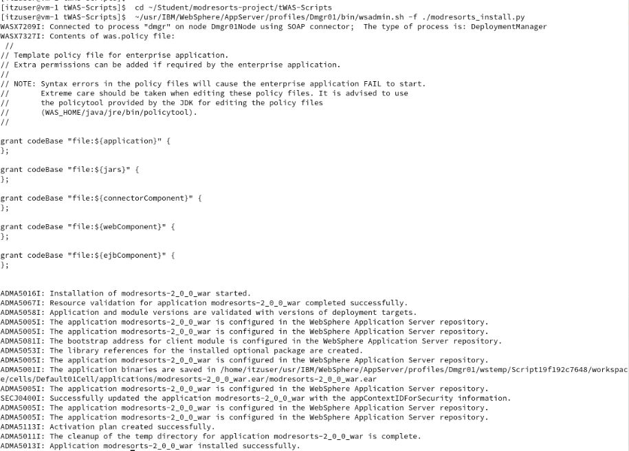</kbd>

5. Set the URLProvider using wsadmin by entering the following commands:

        ~/usr/IBM/WebSphere/AppServer/profiles/Dmgr01/bin/wsadmin.sh -f ./setURLProvider.py

    <kbd>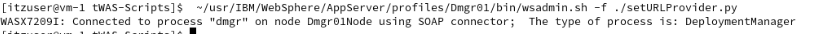</kbd>

6. Enter the following command to start the WAS server server1

       ~/usr/IBM/WebSphere/AppServer/profiles/AppSrv01/bin/startServer.sh server1

    Wait until the server serer1 has been started
    
    <kbd>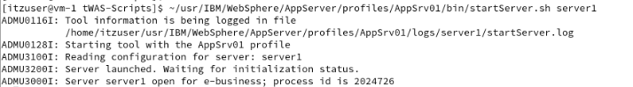</kbd>

6. Test the application

    1. Open a browser window by clicking on **Activities** and then select the **Firefox** browser icon.

        <kbd></kbd>

    2. Access the application on tWAS using the URL http://localhost:9080/resorts

    <kbd>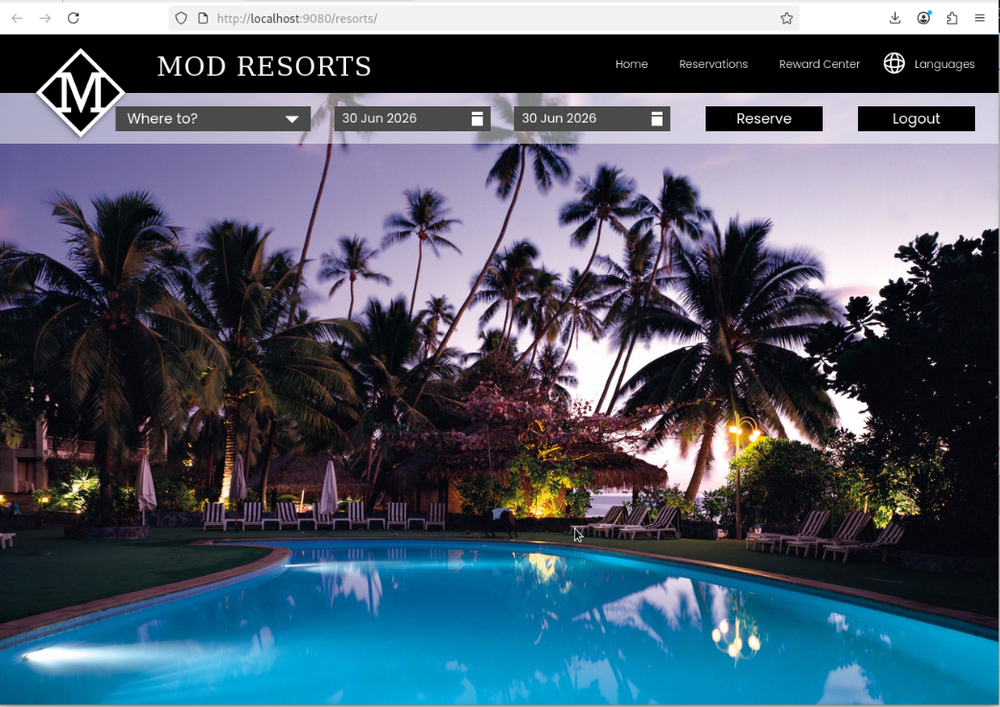</kbd>

    3. Click on **Where to** and switch to Paris or another city. 

    <kbd></kbd>

    Verify that there are no errors shown. 
    
    <kbd>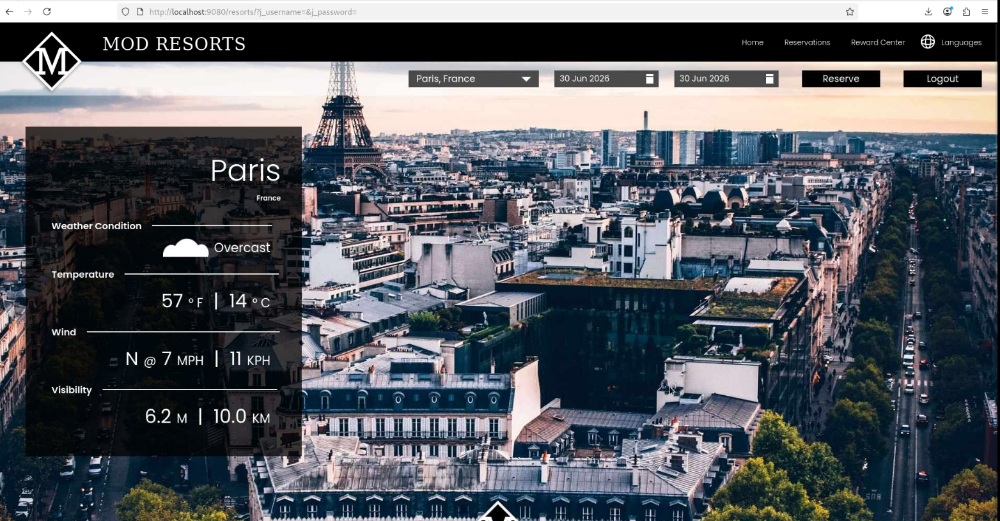</kbd>
    
    4. Click on the link for **Logout** and check that there are no errors

    <kbd>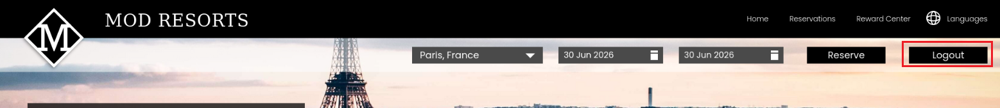</kbd>

    Verify that there are no errors shown. 
    
    <kbd>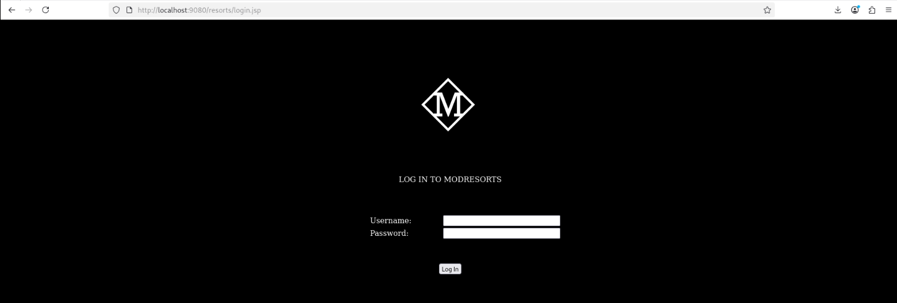</kbd>

7. Stop the WAS instances

        ~/usr/IBM/WebSphere/AppServer/profiles/AppSrv01/bin/stopServer.sh server1
        ~/usr/IBM/WebSphere/AppServer/profiles/AppSrv01/bin/stopNode.sh
        ~/usr/IBM/WebSphere/AppServer/profiles/Dmgr01/bin/stopManager.sh

As you have seen, the application works without any issue on WebSPhere Traditional v9. The next step is to assess the application via AMA to find out which issues must be resolved to make the application work on Liberty with Java 8.

### 6.3.3 Create an AMA data collection for the WAS applications

You will now switch back to the AMA User Interface and create a new workspace called **Evaluation**. Then you will download the AMA Discovery Tool to scan the existing WebSphere landscape.

To evaluate on-premises Java applications, you need to run the AMA Discovery Tool against the Application server environment. It will extract application information from the environment. The utility can be downloaded from the AMA.

1. Create in AMA a new workspace and download the AMA Discovery Tool.
    1. Open a browser window by clicking on **Activities** and then select the **Firefox** browser icon.

    2. Access the AMA User Interface via the URL http://localhost:30000

        <kbd>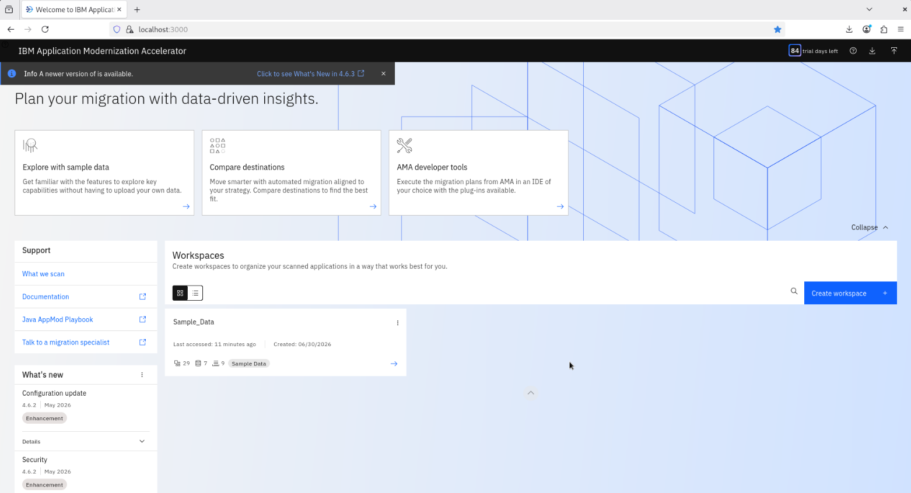</kbd>
    

    3. Click on the button **Create workspace** and enter **Evaluation**, do NOT select **include sample data**, then click on **Create**.

        <kbd>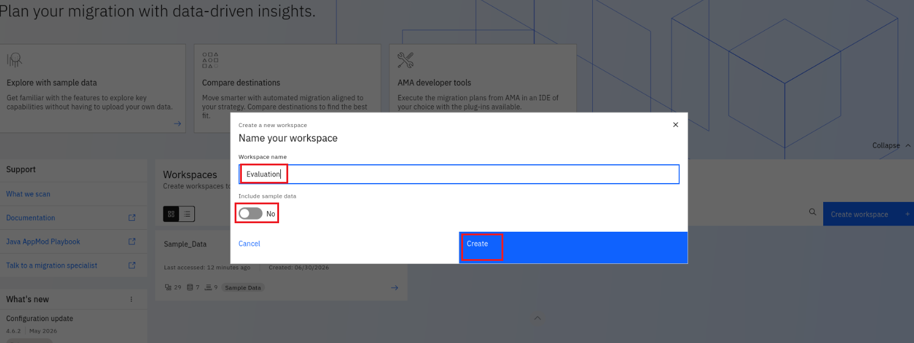</kbd>
    
    4. An empty workspace will be created and you will be asked if you want to upload an existing data collection or if you want to use the Discovery Tool.
        <kbd>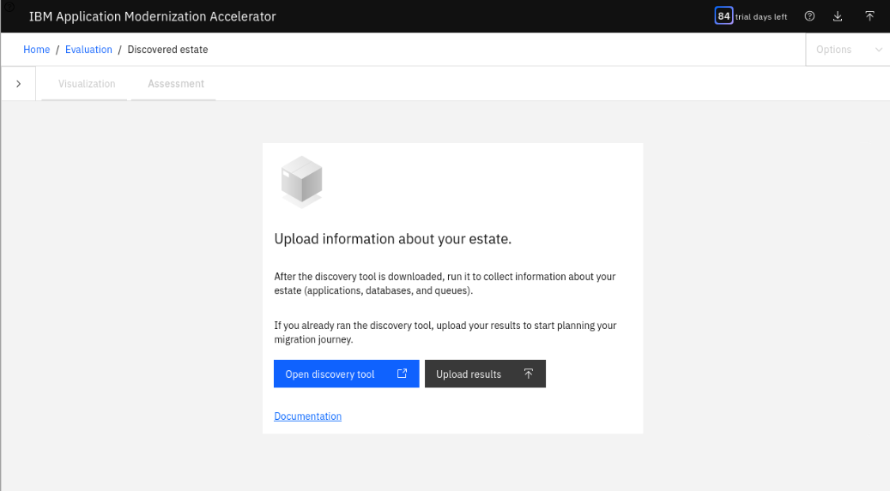</kbd>
    
    5. Click on **Open discovery tool**.
        <kbd>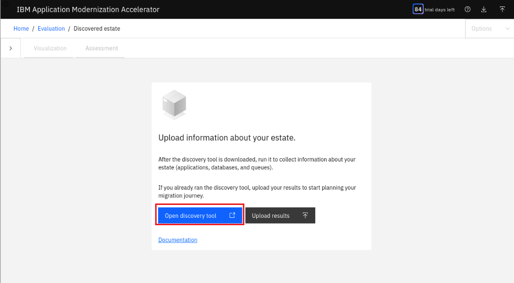</kbd>
    The Discovery Tool panel opens and provides the option to download the tool, in addition it provides information how to use the tool. 
    6. Click on **Download discovery tool**.
    <kbd>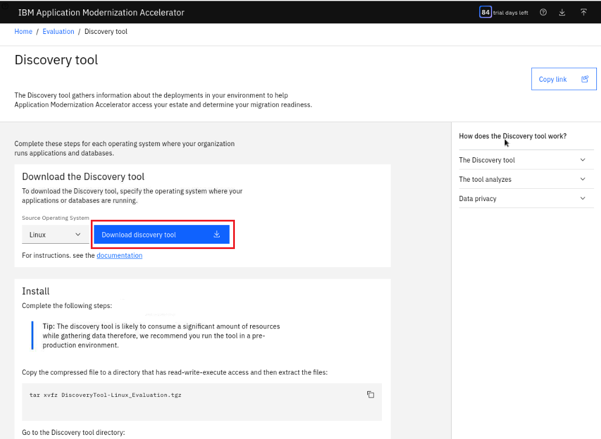</kbd>
    The AMA Discovery Tool package will be generated and downloaded.
    <kbd>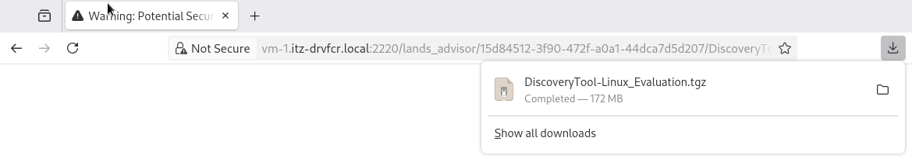</kbd>
    It will include next to the scanner also the information to upload the data collection once created.
    
2. Use the AMA Discovery Tool to analyze the installed WebSphere Applications.

    Run the AMA Discovery Tool against your WebSphere environment.After downloading the zipped Data Collector utility, it needs to be unpacked and run against a WebSphere Application server (WAS) to collect all the data of deployed applications and their configuration from the WAS server.

    1. Go back to the Terminal window and navigate the /home/itzuser/Downloads directory and view its contents with commands:

            cd /home/itzuser/Downloads/
            ls -l | grep Discovery

        <kbd>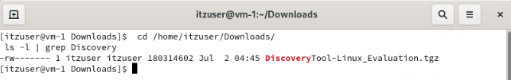</kbd>
            
        You can see the downloaded Discovery Tool file named “DiscoveryTool-Linux_Evaluation.tgz”

    2. Extract the data collector utility to the Student directory using the following command:

            tar xvfz DiscoveryTool-Linux_Evaluation.tgz -C ~/Student

        The Discovery Tool will be extracted to ~/Student/ama-discovery-4.6.2 directory.

        Note: At this point, the data collector is ready to execute against a WebSphere environment.

    3. Return to the AMA UI in the Web browser to view the section on “Run the Tool”, which shows the command to run on the WebSphere environment.

        a. From the Discovery Tool page, scroll down to the “Run Tool” section.

        <kbd>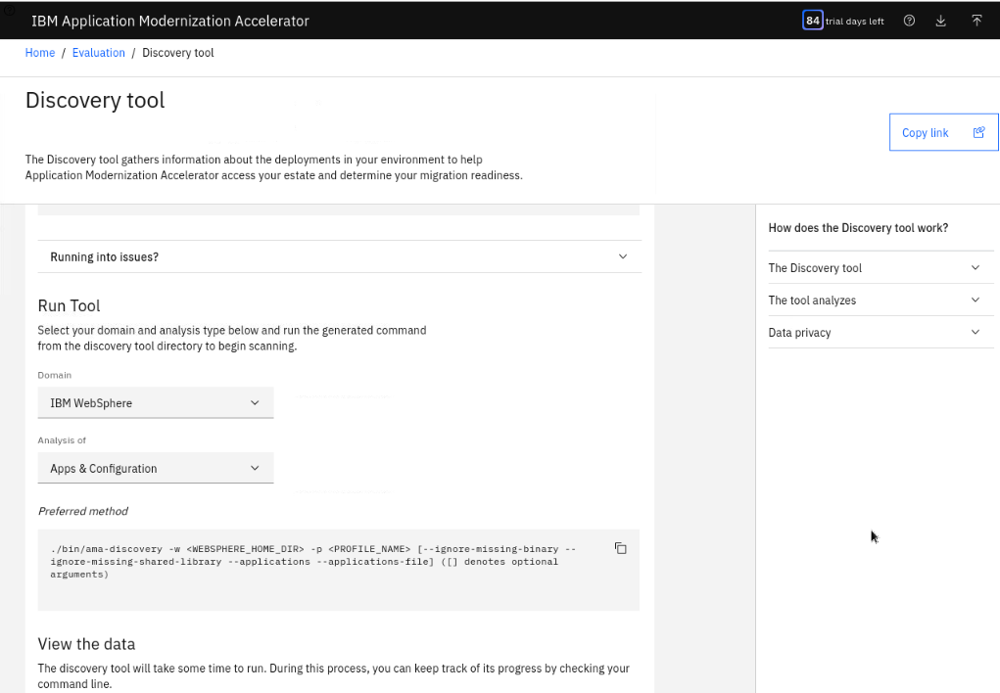</kbd>
        
        The Discovery tool command that would be executed is based on the domain and analysis type selections you make in this section.

        b. Select the domain.

        Open the twisty to see the different domain options:

        <kbd>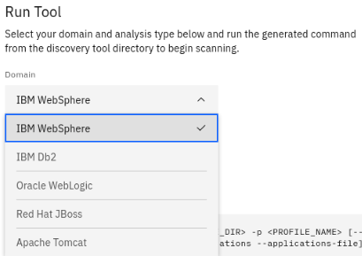</kbd>
        
        Change the domain and you can see that the command will change.
        Finally switch back to the **IBM WebSphere** Domain. 

        c. Select the Analysis type
        
        Open the twisty to see the different analysis types:

        <kbd>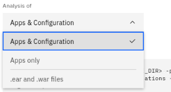</kbd>
        
        Change the analysis type and you can see that the command will change. Finally switch back to the **Apps & Configuration** analysis. 
        Selecting **Apps & Configuration** ensures that the application data and server configuration data is collected.
 
        The server configuration data is extremely helpful in Transformation Advisor to generate deployment artifacts in the migration bundle, which we will explore later in the lab.
 
        d. Review the final command.
        To analyze the application and configuration for WebSphere will be done using a command as shown in the screenshot
        <kbd>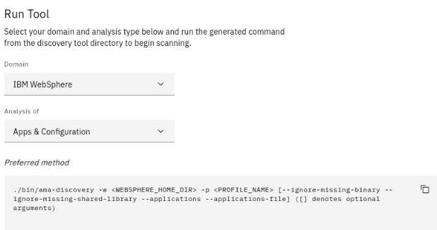</kbd>
    

6.  Execute the AMA Discovery Tool.

    1. Go back to the Terminal window and navigate the directory where the AMA Discovery Tool was extracted, then list the content:

            cd ~/Student/ama-discovery-4.6.2
            ls -l

        <kbd>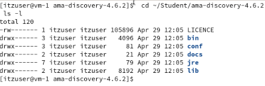</kbd>

    2.  Execute the following command to start the AMA Discovery Tool:

            ./bin/ama-discovery -w ~/usr/IBM/WebSphere/AppServer

        <kbd>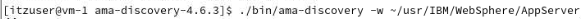</kbd>

        The license agreement will be displayed. 
        
        <kbd>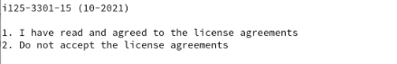</kbd>
        

        Type **1** to accept the license agreement and press **Enter**.

    3. Wait until the analysis has completed. As you can see, 4 applications have been analyzed and the resulting data collection has been automatically uploaded. 

        <kbd>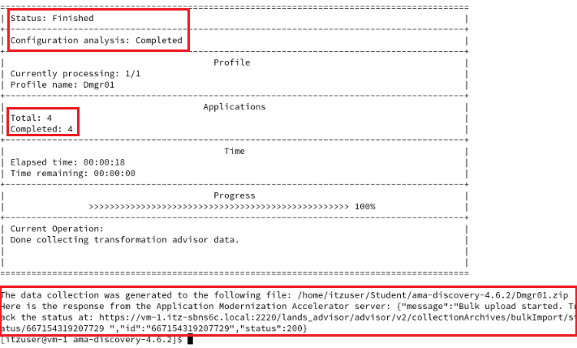</kbd>
    
        The collection is also availabe as zip file in the directory where the dicsovery tool was called.

            ls -l

        <kbd>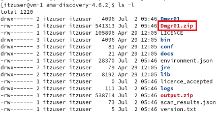</kbd>

        Comment: In the lab, the process only takes a couple of seconds. In a real scenario, the process typically takes some time to complete, depending on how many applications are deployed on the WebSphere Application server and the complexity of the applications. 
        As this process consumes some CPU and memory, it is not recommended to run the discovery tool in production.

    4. Return to the AMA UI in the Web browser and you can see that the data collection has been uploaded. You will be asked to specify the modernization destination. Select **Liberty** as destination and click on **Confirm**.
    
        <kbd></kbd>

        The Evaluation workspace will open in the Visualization View. 
    
        <kbd>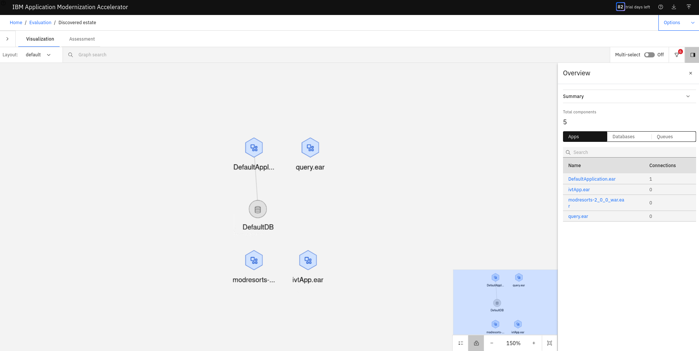</kbd>

        You can see the 4 applications that have been discovered.

    In general, if your application server and **AMA** are in the same network infrastructure, the collected data will be automatically uploaded to **AMA** for you  to view the analysis results. 
    Otherwise, you must manually upload the data to **AMA** before you can view the results. You could also specify not to upload the data collection automatically.
    
    **IMPORTANT!**
    
    As backup for this lab, we have already executed the the collector on a WebSphere Application Server. And the resulting data collection archive (zip file) named AppSrv01.zip is provided for you to upload into the AMA UI. 
    ___

### 6.3.2 Assess the applications using AMA

In this section of the lab, you will explore assessment details for the **modresorts** application. 

1. In the AMA Visualization View, you can see that the modresorts application has no connections to a database or queue.
 
    <kbd>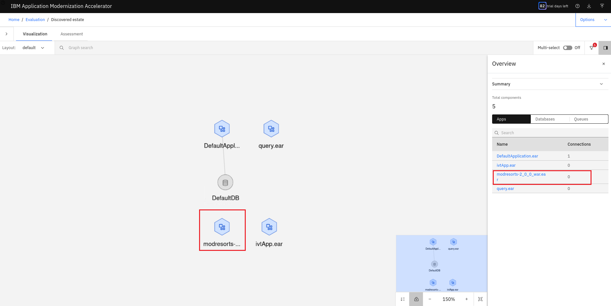</kbd>

2. Switch to the Assessment View.

    <kbd>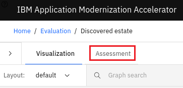</kbd>

    You can see the assement details for the 4 applications and the efforts to modernize them them to Liberty.
    <kbd>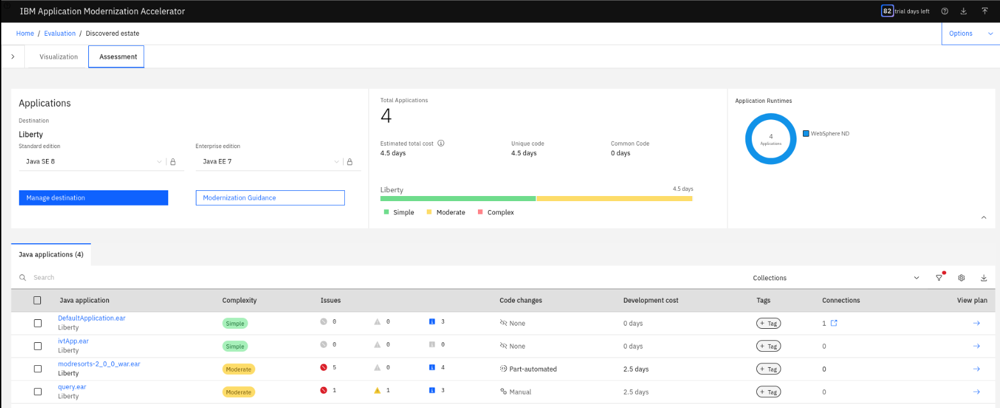</kbd>

3. In the environment, the trial version of AMA is used. Therefore the assessment of the applications for higher Java SE level or Java EE level is only supported for sample data workspaces but not in this workspace. You would need a permanent access key to unlock the option.

    <kbd>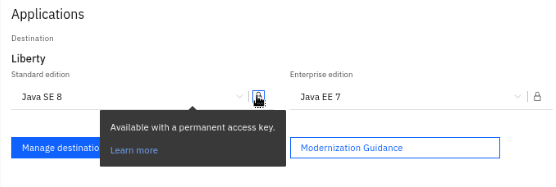</kbd>

4. You will now assess the modresorts application.

    1. Enter as filter the text *modr** to see only the modresorts application. 

        <kbd>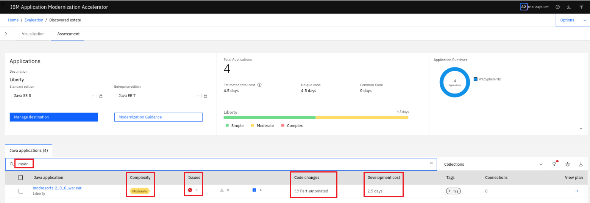</kbd>

        The application modresorts has been assessed
        - of complexity **Moderate**, which means that code changes might be required
        - **5 severe issues** have been identified with need to be fixed
        - some of the required code changes can be done automated via recipes
        - the estimated development effort is 2.5 days
    
    2. Click on the application to get more details
        
        <kbd>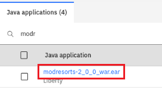</kbd>

    
    3. Expand the **`Complexity Rules`** for moving the application to WebSphere Liberty. 

        <kbd>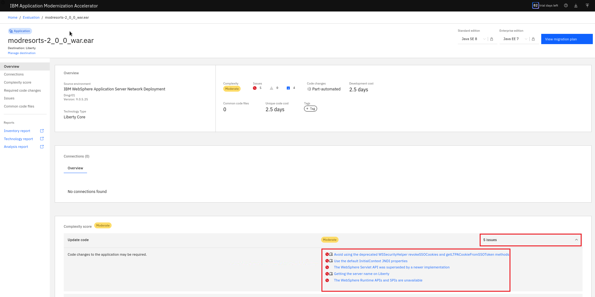</kbd>

        From this view, you get insights into the related issues that may require code changes or configuration changes. 

        *In this example, there is 5 issues of which 3 have an automated fix:*

        - **Avoid using the deprecated WSSecurityHelper revokeSSOCookies and getLTPACookieFromSSOToken methods**
        - **Use the default InitialContext JNDI properties**
        - **The WebSphere Servlet API was superseded by a newer implementation**
        - **Getting the server name on Liberty**
        - **The WebSphere Runtime APIs and SPIs are unavailable**

        There are also 4 **informational issue** which are well known and documented how to resolve by the migration tools.

        <kbd>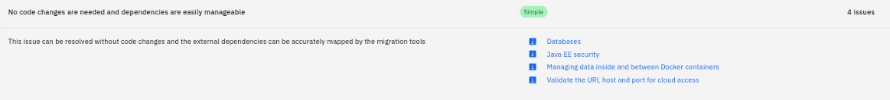</kbd>

    4. Scroll down to the section about unique code issues and expand it.

        <kbd>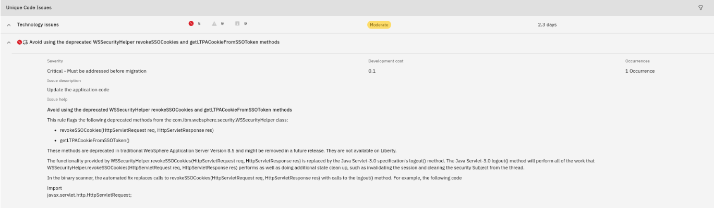</kbd>

        Expand any of the 5 issues and you can get more details about the issue, recommended changes and which code is impacted.

    5. In addition to the information in the view, AMA also provides different kinds of reports:

        <kbd>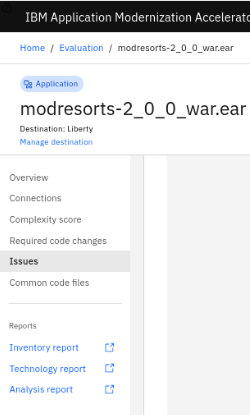</kbd>

        - The **Inventory Report** helps you examine what is in your application, including the number of modules and the technologies in those modules. It also gives you a view of all the utility JAR files in the application that tend to accumulate over time. Potential deployment problems and performance considerations are also covered.
       
        - The **Technology Report** identifies the editions of WebSphere Application Server that are best suited to run the application. The report provides a list of Java EE programming models that are used by the application and indicates which platforms will support the application.

        - The **Analysis Report** does a deep dive on the preferred migration target to help you understand any migration issues, like deprecated or removed APIs, Java SE version differences, and Java EE behavioural differences. Note that Application Modernization Accelerator uses a rule system based on commonly occurring events that are seen in real applications to enhance the base reports and provide practical guidance. As a result, some items may show a different severity level in Application Modernization Accelerator than they do in the detailed binary scanner reports.

       

### 6.3.3  Examine the Liberty modernization assets generated by AMA

AMA not only provides great insights about your applications that you consider modernizing to WebSphere Liberty, it also generates deployment accelerators for building and deploying the application on Liberty, containers, and Kubernetes based clouds. 

In this section, we take a quick peak at the **Liberty server configuration** `server.xml` that AMA generates, based on the analysis of the WebSphere configuration when the Transformation Advisor data collector was run against the WebSphere server on the VM.  

Simply put, AMA creates the server.xml file that contains the Liberty server configuration required to run the application on Liberty.  

1.	On the modresorts page, click on the button in the upper right called **View migration plan**.

    <kbd>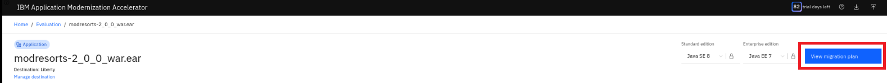</kbd>

 
2.	The **Migration plan** displays a "partial list" of files generated by AMA to assist in the migration of the application.

    - **server.xml:** the configuration for the Liberty server
    - **pom.xml:** Build the application using Maven
    - **Containerfile:** Create the Docker image for the application
    - **application-cr.yaml:** Custom Resource for the application to be deployed to OpenShift via the Open Liberty Operator
    - **secret.yaml:** Configuration file for defining secrets etc. in Kubernetes

    <kbd>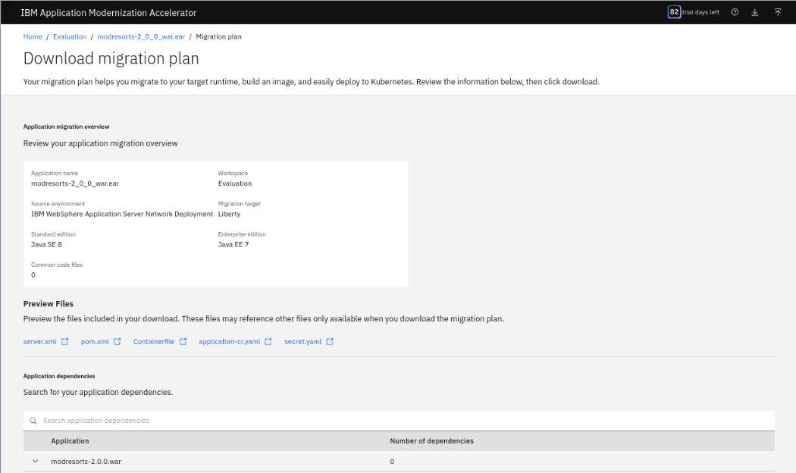</kbd>

3.	Click to view the contents of the **server.xml** file.
	The **server.xml** is displayed in the File preview window, click **`Show more`** to expand it.    
    <kbd>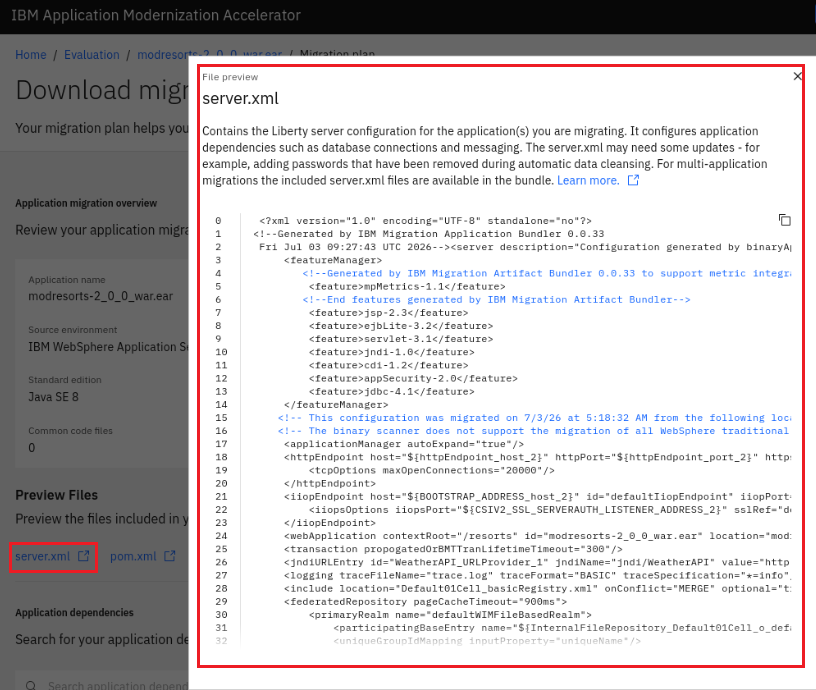</kbd>

4.	Review the contents of the **server.xml** file.

    Notice that AMA generated the **server.xml** file that includes the Liberty server configuration that has been mapped from the original WebSphere traditional application server. 

    When the AMA Discovery Tool was run against the WebSphere Application server, it analyzed the applications and the WebSphere server configuration. The WAS server configuration data was used to generate an appropriate server.xml file to configure the application on Liberty. 

    a.	The **Liberty features** that the application uses are configured. 

    <kbd>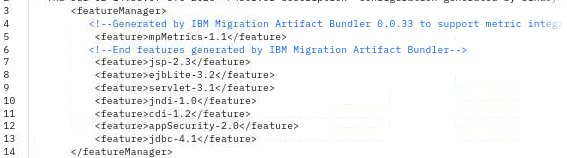</kbd>

    b.	The **application endpoints** and **enterprise application module configuration** including **context root**, **Security roles** used by the application are configured. Notice that **variables ${ }** are used to simplify external configuration overrides and default values. 
    <kbd>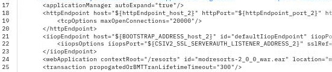</kbd>

    c.	**Ressource configurations** like URLProviders, JDBC or JMS Provider, etc.

    <kbd></kbd>

    d.	**Variables** with default values, where it makes sense are configured.
    These variables are used to make the configuration portable so that it can be used in different stages.

    <kbd>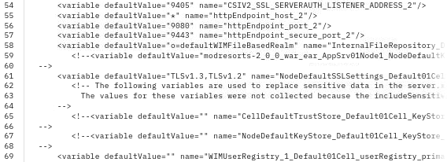</kbd>

    The variables are easily overridden by environment variables or configMaps and secrets in Kubernetes environments. 

    e. Close the File Preview, then scroll down and open the twisty to see application dependencies. As you can see, the application ha no dependencies

    <kbd>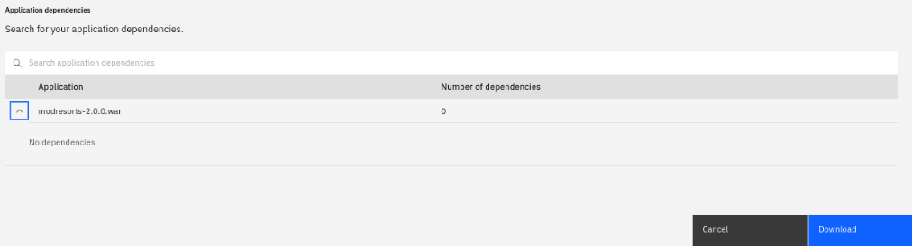</kbd>

5. Click to download the **Migration Plan** generated by AMA.

    <kbd>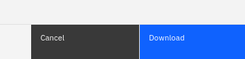</kbd>

    The migration plan will be downloaded to the Downloads folder
    <kbd>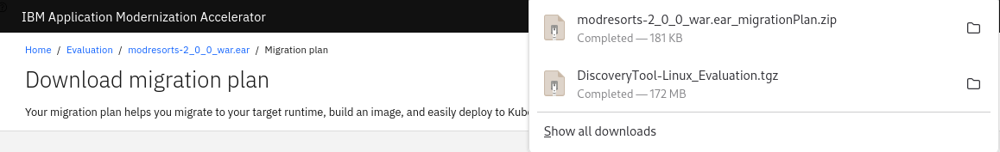</kbd>

    
10.	Switch to the terminal window and execute the following command to see the content of the migration bundle. 

        unzip -t ~/Downloads/modresorts-2_0_0_war.ear_migrationPlan.zip 

    
    <kbd>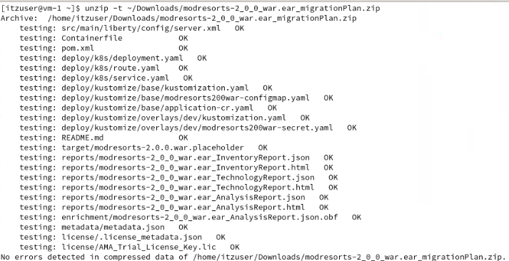</kbd>

    Next to the files mentioned before, the migration bundle contains several other files for Kubernetes deployment, for kustomization as well as placeholder files for the application and the JDBC drivers.

    As you can see, the migration plan contains a trial key.
    As it is a migration plan created by a AMA Trial version, it can only be used with AMA Dev Tools if AMA Dev Tools have a license applied.

### 6.3.8 Recap

Congratulations, you have finished the application assessment part.

**Let’s recap what you did so far.** 

- You installed and tested the modresorts application on a traditional WAS instance
- You explored AMA using some application data 
- You ran the AMA Discovery Tool to assess a WebSphere cell
- You assessed the modresorts application
- You generated a migration plan

### 6.3.9 Troubleshooting

You will need the migratin plan in the next section. 

1. If not already done, create the required working directories

        mkdir ~/Student
        mkdir ~/Student/assets
        
2. Create a backup directory and clone the repository 
 
        mkdir ~/Student/backup
        git clone https://github.com/LarsBesselmann/LibertyGettingStarted-2026-Lab ~/home/itzuser/Student/backup

3. Copy the server package to the assets directory

        cp ~/Student/backup/assets/simpleweb-serverpackage.jar ~/Student/assets

 

### 6.4 Use the AMA Dev Tools

### 6.5 Recap

Let’s recap what you did in this part of the lab: 

### 7 Lab Cleanup

1. Once you are done, make sure that Liberty and Visual Studio Code is not running.

2. Delete the Student folder via command:

        rm -rf ~/Student

3. Close the browser and all terminal windows

## Summary

In this lab, you learned how to assess a WebSphere application using IBM Application Modernization Accelerator.

**Congratulations!**

**You have successfully completed the lab "Liberty Getting Started"**

# Troubleshooting

Details around troubleshooting

